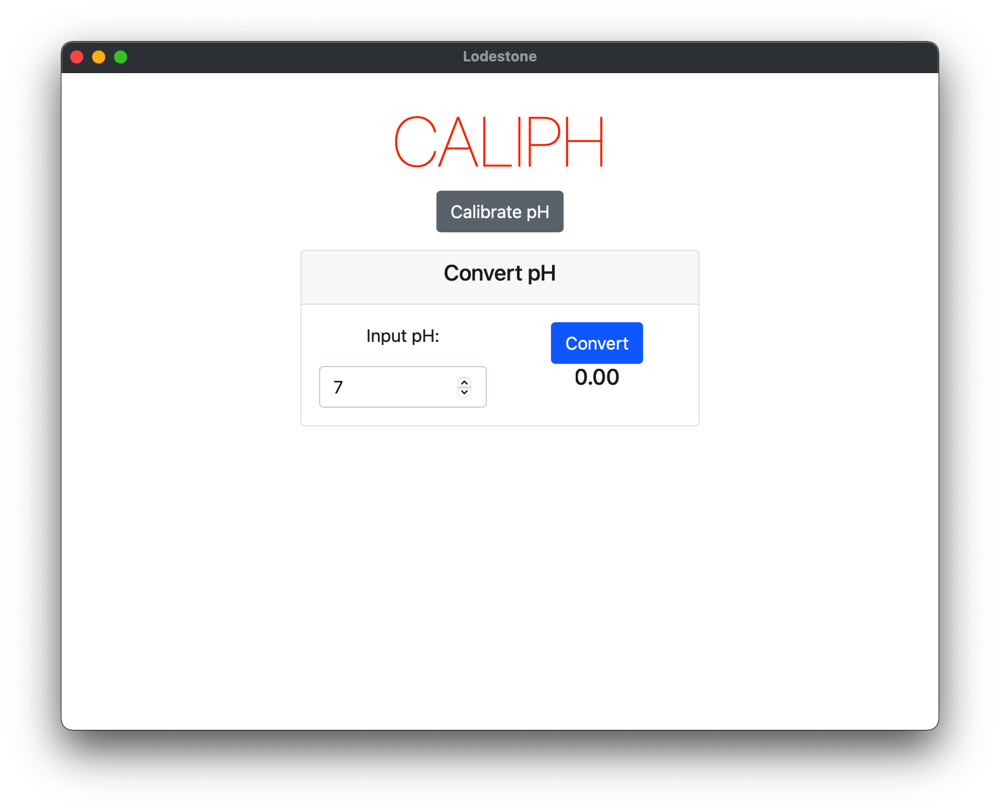
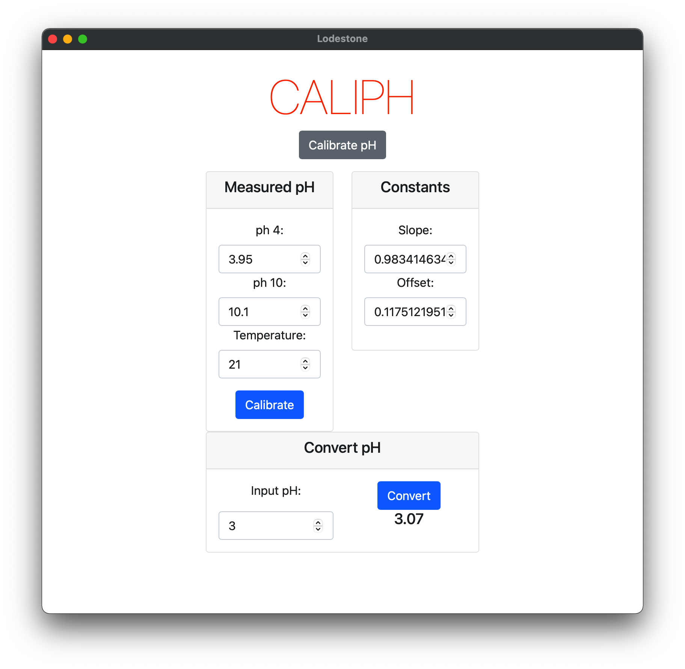

# caliphta

[](https://opensource.org/licenses/MPL-2.0)
[](https://creativecommons.org/licenses/by-sa/4.0/)
<!-- [](https://github.com/pdunne/caliphta/actions/workflows/rust.yml) -->

A simple GUI version of the pH calibration tool [caliph](https://github.com/pdunne/caliph) written as a learning exercise using [Tauri](https://tauri.studio/en/), and [Svelte](https://svelte.dev).

## Usage

- Native binaries are provided under [releases](https://github.com/pdunne/caliphta/releases)
- Cloning the repo and running locally (see below)

<figure>
  
  
  <figcaption>Collapsed and expanded Menu</figcaption>
</figure>

## Testing locally

```console
git clone https://github.com/pdunne/caliphta.git
cd caliphta
```

### Debug Mode

```console
yarn tauri dev
```

### Build

```console
yarn tauri build
```
